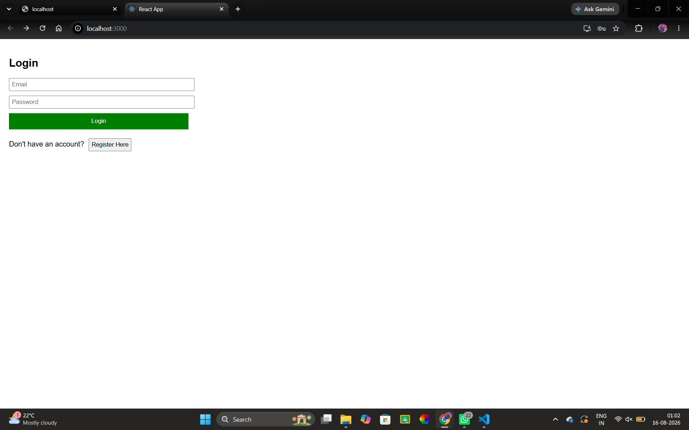
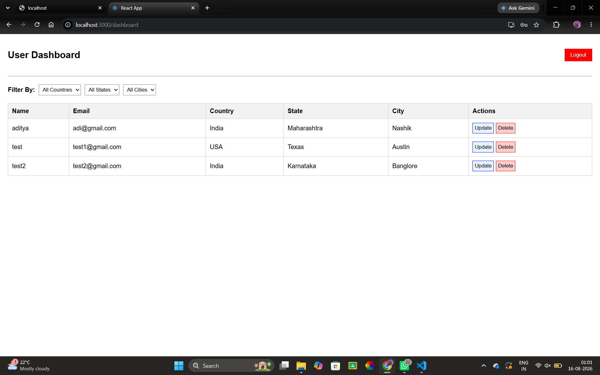

# 📊 User Management Dashboard

## 🚀 Project Overview
This project is a React-based User Management Dashboard built for a technical assessment. It features user registration, secure authentication routing, and full CRUD operations with cascading location filters.

## 📸 Screenshots

### Login & Registration

### Main Dashboard (CRUD & Filters)

## 🛠️ Setup & Execution Instructions
1. Clone this repository to your local machine.
2. Open your terminal and navigate into the project directory.
3. Run `npm install` to install all dependencies (including `react-router-dom`).
4. Run `npm start` to launch the development server.
5. The application will automatically open at `http://localhost:3000`.

## 🧠 Architectural Decisions & Mock API
* **Database:** I utilized the browser's native `localStorage` as a mock database. This ensures data persistence across page reloads while providing a seamless, "zero-setup" experience for the review process (no need to configure a separate backend server).
* **State Management:** I implemented `useReducer` for complex state logic (specifically for the editing forms and filtering functionality) to maintain clean and predictable component updates.
* **Routing:** Handled via `react-router-dom`, including basic route protection to prevent unauthorized access to the dashboard.

## ✨ Implemented Features
* **Authentication:** Full registration and login flow with credential validation.
* **Cascading Data:** Structured hierarchical location data (Country → State → City) dynamically integrated into both the Registration form and Dashboard filters.
* **Dashboard CRUD:** Complete functionality to view, filter, update (inline), and delete user records.
